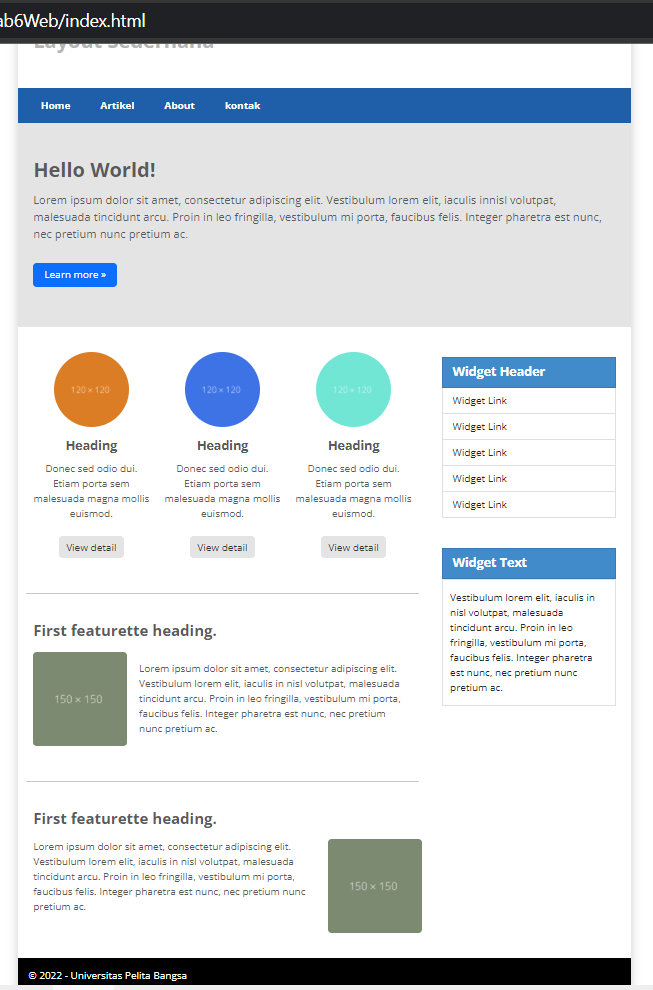

# :rocket: Latihan Menggunakan [Bootstrap](https://getbootstrap.com/)

- Nama : Hizbullah Ridwan
- NIM : 312110055
- Kelas : TI.21.B.1
- Mata Kuliah : Pemrograman Web

Dalam latihan Bootstrap ini, saya menggunakan [Bootstrap Versi 5.2](https://getbootstrap.com/), [Google Chrome](https://www.google.com/intl/id_id/chrome/) sebagai web browser dan [Visual Studio Code](https://code.visualstudio.com/) sebagai teks editornya.

Daftar isi :

- [Install CDN](https://github.com/Ridwanwildan/Lab6Web#install-cdn)
- [Add Header](https://github.com/Ridwanwildan/Lab6Web#add-header)
- [Add Navbar](https://github.com/Ridwanwildan/Lab6Web#add-navbar)
- [Add Hero](https://github.com/Ridwanwildan/Lab6Web#add-hero)
- [Add Main Content](https://github.com/Ridwanwildan/Lab6Web#add-main-content)
- [Add Aside](https://github.com/Ridwanwildan/Lab6Web#add-main-aside)
- [Add Footer](https://github.com/Ridwanwildan/Lab6Web#add-main-footer)
- [Result](https://github.com/Ridwanwildan/Lab6Web#result)

Latihan ini adalah latihan slicing design website yang sudah ada ke bootstrap.  
Design nya bisa dilihat disini : [Capture1.PNG](Screenshoots/Capture1.PNG)

## Install CDN

Pertama adalah menyiapkan folder yang didalamnya berisi `index.html` dan `style.css`. Kemudian buat html  
dasar seperti ini :

```bash
<!DOCTYPE html>
<html lang="en">
<head>
    <meta charset="UTF-8">
    <meta http-equiv="X-UA-Compatible" content="IE=edge">
    <meta name="viewport" content="width=device-width, initial-scale=1.0">
    <link rel="stylesheet" href="style.css">
    <link href="https://cdn.jsdelivr.net/npm/bootstrap@5.2.2/dist/css/bootstrap.min.css" rel="stylesheet" integrity="sha384-Zenh87qX5JnK2Jl0vWa8Ck2rdkQ2Bzep5IDxbcnCeuOxjzrPF/et3URy9Bv1WTRi" crossorigin="anonymous">
    <title>Belajar Bootstrap</title>
</head>
<body>

</body>
</html>
```

Disini sudah disiapkan link CDN bootstrap dan juga tambahan CSS eksternal buatan sendiri.

## Add Header

Selanjutnya adalah menambahkan header. Didalam header ini sudah ditambahkan class yang berasal dari [Bootstrap](https://getbootstrap.com/)  
dan ada juga class yang dibuat sendiri.

```bash
<header>
    <h1 class="px-4 py-5 fw-bolder fs-2 font-color-grey">
        Layout Sederhana
    </h1>
</header>
```

## Add Navbar

Untuk menambahkan navbar versi [Bootstrap](https://getbootstrap.com/) sebenarnya banyak berbagai macam pilihan, navbar ini disamakan tampilannya seperti design yang sudah ada sebelumnya. ditambah juga dengan CSS eksternal. Seperti ini :

```bash
<nav class="navbar navbar-expand-lg bg-color-blue">
    <div class="container-fluid">
        <button class="navbar-toggler" type="button" data-bs-toggle="collapse" data-bs-target="#navbarNavAltMarkup" aria-controls="navbarNavAltMarkup" aria-expanded="false" aria-label="Toggle navigation">
            <span class="navbar-toggler-icon"></span>
        </button>
        <div class="collapse navbar-collapse" id="navbarNavAltMarkup">
            <div class="navbar-nav">
                <a class="nav-link active fw-bolder font-color-white px-4" aria-current="page" href="#">Home</a>
                <a class="nav-link fw-bolder font-color-white px-4" href="#">Artikel</a>
                <a class="nav-link fw-bolder font-color-white px-4" href="#">About</a>
                <a class="nav-link fw-bolder font-color-white px-4" href="#">kontak</a>
            </div>
        </div>
    </div>
</nav>
```

## Add Hero

Kali ini section hero akan diisi oleh deskripsi website. Dengan warna background abu-abu dan ada tambahan buttonnya.

```bash
<section class="px-4 py-5 hero">
    <h1 class="py-2 fs-2 fw-bolder font-color-grey-2 ">Hello World!</h1>
    <p class="font-color-grey-2 lh-base">
        Lorem ipsum dolor sit amet, consectetur adipiscing elit. Vestibulum lorem
        elit, iaculis innisl volutpat, malesuada tincidunt arcu. Proin in leo fringilla,
        vestibulum mi porta, faucibus felis. Integer pharetra est nunc, nec pretium nunc
        pretium ac.
    </p>
    <div class="py-3">
        <button type="button" class="btn btn-primary px-3">Learn more &raquo;</button>
    </div>
</section>
```

## Add Main Content

Antara Main content dan aside terbagi menjadi dua, main content memiliki 8 grid dan aside 4 grid. Main content di website ini terbagi lagi menjadi tiga, yaitu section 1, 2, dan 3. Setiap sectionnya dipisah dengan `<hr>`. Sebelum membuat `<section>`, terlebih dahulu buat container yang berisi 8 gridnya seperti ini :

```bash
<div class="container">
  <div class="row">
    <main class="col-8">
        <!-- Insert main content here -->
    </main>
    <aside class="col-4">
        <!-- Insert aside here -->
    </aside>
  </div>
</div>
```

### Section 1

section 1 diisi oleh tiga row yang didalamnya terdapat circle image, text, dan button. Untuk mengubah image menjadi circle perlu CSS class tambahan yang sudah diberi class name `image-circle`.

```bash
<section class="container text-center">
  <div class="row">
    <div class="col py-4">
      
      <div class="fs-5 fw-bolder font-color-grey-2">Heading</div>
      <div class="py-2 font-color-grey-2">
        Donec sed odio dui. Etiam porta sem malesuada magna mollis euismod.
      </div>
      <div class="py-3">
        <button type="button" class="btn btn-secondary">View detail</button>
      </div>
    </div>
    <div class="col py-4">
      
      <div class="fs-5 fw-bolder font-color-grey-2">Heading</div>
      <div class="py-2 font-color-grey-2">
        Donec sed odio dui. Etiam porta sem malesuada magna mollis euismod.
      </div>
      <div class="py-3">
        <button type="button" class="btn btn-secondary">View detail</button>
      </div>
    </div>
    <div class="col py-4">
      
      <div class="fs-5 fw-bolder font-color-grey-2">Heading</div>
      <div class="py-2 font-color-grey-2">
        Donec sed odio dui. Etiam porta sem malesuada magna mollis euismod.
      </div>
      <div class="py-3">
        <button type="button" class="btn btn-secondary">View detail</button>
      </div>
    </div>
  </div>
</section>
```

### Section 2

Section 2 diisi oleh dua row yang didalamnya ada rounded image disebelah kiri dan text disebelah kanan.

```bash
<section class="py-4">
  <div class="container fs-4 fw-bolder font-color-grey-2">
    First featurette heading.
  </div>
  <div class="container">
    <div class="row">
      <div class="col-3 py-3">
        
      </div>
      <div class="col-9 px-4 my-auto font-color-grey-2">
        Lorem ipsum dolor sit amet, consectetur adipiscing elit. Vestibulum
        lorem elit, iaculis in nisl volutpat, malesuada tincidunt arcu. Proin in
        leo fringilla, vestibulum mi porta, faucibus felis. Integer pharetra est
        nunc, nec pretium nunc pretium ac.
      </div>
    </div>
  </div>
</section>
```

### Section 3

Section 3 diisi oleh dua row yang didalamnya ada text disebelah kiri dan rounded image disebelah kanan.

```bash
<section class="py-4">
  <div class="container fs-4 fw-bolder font-color-grey-2">
    First featurette heading.
  </div>
  <div class="container">
    <div class="row">
      <div class="col-9 my-3 font-color-grey-2">
        Lorem ipsum dolor sit amet, consectetur adipiscing elit. Vestibulum
        lorem elit, iaculis in nisl volutpat, malesuada tincidunt arcu. Proin in
        leo fringilla, vestibulum mi porta, faucibus felis. Integer pharetra est
        nunc, nec pretium nunc pretium ac.
      </div>
      <div class="col-3 py-3">
        
      </div>
    </div>
  </div>
</section>
```

## Add Aside

Selanjutnya adalah menambahkan content pada aside, content yang ada di `aside` ada dua. Yaitu widget yang didalamnya berisi list, dan juga widget yang didalamnya berisi text.

### Widget List

Pertama adalah widget list seperti ini :

```bash
<div class="container my-5">
  <div class="list-group">
    <div
      class="list-group-item list-group-item-action list-group-active font-color-white fw-bolder fs-5"
      aria-current="true"
    >
      Widget Header
    </div>
    </a>
    <a href="#" class="list-group-item list-group-item-action"
      >Widget Link</a
    >
    <a href="#" class="list-group-item list-group-item-action"
      >Widget Link</a
    >
    <a href="#" class="list-group-item list-group-item-action"
      >Widget Link</a
    >
    <a href="#" class="list-group-item list-group-item-action"
      >Widget Link</a
    >
    <a href="#" class="list-group-item list-group-item-action"
      >Widget Link</a
    >
  </div>
</div>
```

### Widget Text

Kemudian yang kedua adalah widget text seperti ini :

```bash
<div class="container my-4">
  <div class="list-group">
    <div
      href="#"
      class="list-group-item list-group-item-action list-group-active font-color-white fw-bolder fs-5"
      aria-current="true"
    >
      Widget Text
    </div>
    <div class="container border py-3">
      Vestibulum lorem elit, iaculis in nisl volutpat, malesuada tincidunt arcu.
      Proin in leo fringilla, vestibulum mi porta, faucibus felis. Integer
      pharetra est nunc, nec pretium nunc pretium ac.
    </div>
  </div>
</div>
```

## Add Footer

Terakhir adalah menambahkan footer. Gunakan tag `<footer>` dengan warna backgroung hitam. Seperti ini :

```bash
<footer class="py-3 bg-color-black font-color-white">
  &copy; 2022 - Universitas Pelita Bangsa
</footer>
```

## Result

Setelah selesai, maka hasilnya bisa dilihat di :link:https://ridwanwildan.github.io/Lab6Web/ dan akan seperti ini :


